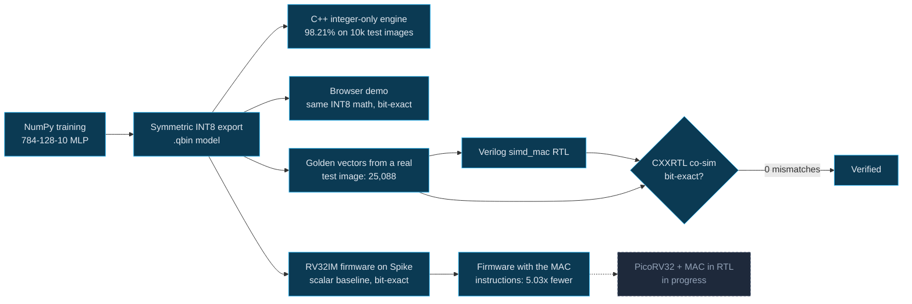
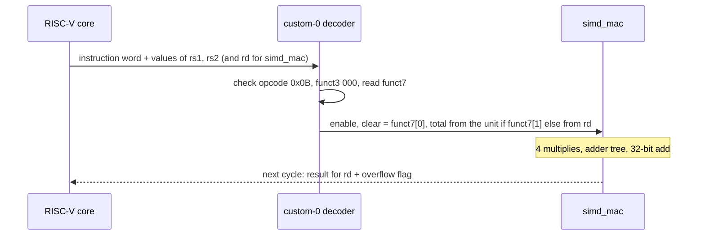
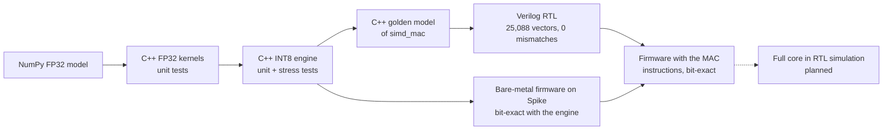
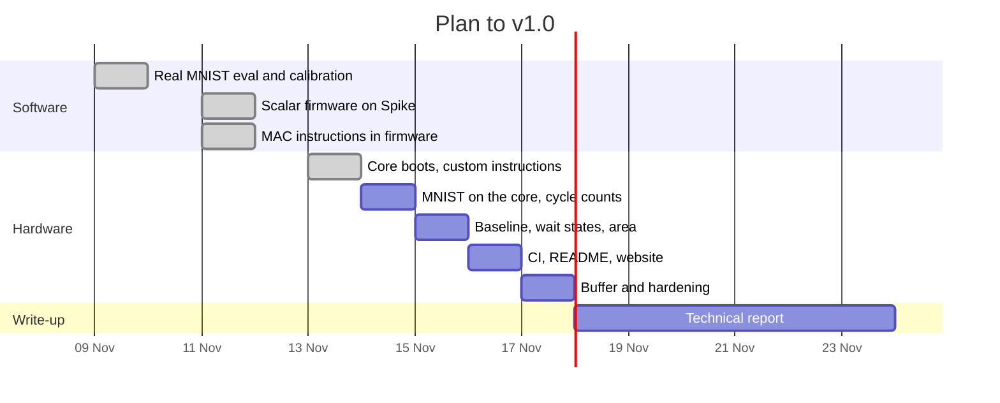

# riscv-edge-ai

Integer-only neural network inference for small RISC-V cores, with a custom 4-lane INT8 multiply-accumulate (MAC) instruction designed in Verilog.

The goal is simple: run useful AI models on cheap microcontrollers that have no floating-point unit. A 32-bit RISC-V register can hold four 8-bit values, but a plain RV32IM core multiplies them one at a time. This project builds the software side (INT8 quantization and a fixed-point runtime) and the hardware side (a SIMD MAC unit mapped to the RISC-V `custom-0` opcode), and verifies that both produce exactly the same results.

<p align="center">
  
</p>

<p align="center">
  <a href="https://sajedulislam5840.github.io/riscv-edge-ai/"></a>
</p>

<p align="center">
  <a href="https://github.com/sajedulislam5840/riscv-edge-ai/actions/workflows/ci.yml"></a>
  <br/>
  <a href="https://sajedulislam5840.github.io/riscv-edge-ai/"><b>Live demo</b></a> ·
  <a href="#verified-results">Results</a> ·
  <a href="#how-it-fits-together">Architecture</a> ·
  <a href="#reproduce">Reproduce</a> ·
  <a href="#roadmap">Roadmap</a>
</p>

---

## Status

| Part | State |
|---|---|
| FP32 reference kernels (GEMM, ReLU, bias, softmax) | Done, unit tested |
| INT8 quantization library (affine, per-channel, Q31 requantization, BN folding, pooling, `.qbin` format) | Done, unit tested on host |
| SIMD MAC RTL (`hardware/rtl/simd_mac.v`) + `custom-0` decoder wrapper | Done, synthesized and verified against golden vectors |
| INT8 evaluation on the real MNIST test set (calibrated activations) | Done: 98.21% INT8 vs 98.23% FP32 |
| Bare-metal RV32IM firmware on Spike, scalar baseline | Done: 818,683 instructions per inference, outputs match the C++ engine |
| Internal-accumulator instructions (`simd_macc` / `simd_macz`) for two-read-port cores | Done: wrapper verified on 25,088 instructions, costs 1 LUT and no Fmax |
| Same firmware with the custom MAC instructions | Done: 162,869 instructions per inference, **5.03x fewer**, outputs unchanged |
| MAC unit inside a RISC-V core (PicoRV32), cycle-accurate RTL simulation | In progress: custom instructions verified on the core (day 1 of 5) |
| Technical report | Planned |

Everything listed as done below can be reproduced with the commands in [Reproduce](#reproduce).

---

## How it fits together


```mermaid
flowchart LR
    A["NumPy training<br/>784-128-10 MLP"] --> B["Symmetric INT8 export<br/>.qbin model"]
    B --> C["C++ integer-only engine<br/>98.21% on 10k test images"]
    B --> F["Browser demo<br/>same INT8 math, bit-exact"]
    B --> D["Golden vectors from a real<br/>test image: 25,088"]
    D --> E["Verilog simd_mac RTL"]
    E --> G{"CXXRTL co-sim<br/>bit-exact?"}
    D --> G
    G -->|"0 mismatches"| H["Verified"]
    B --> I["RV32IM firmware on Spike<br/>scalar baseline, bit-exact"]
    I --> J2["Firmware with the MAC<br/>instructions: 5.03x fewer"]
    J2 -.-> J["PicoRV32 + MAC in RTL<br/>in progress"]

    classDef done fill:#0b3a53,stroke:#38bdf8,color:#e2e8f0
    classDef todo fill:#1e293b,stroke:#64748b,color:#94a3b8,stroke-dasharray:4 3
    class A,B,C,D,E,F,G,H,I,J2 done
    class J todo
```

Solid boxes are done and verified; dashed boxes are in progress or planned.

---

## Verified results

### SIMD MAC hardware

The unit takes two 32-bit registers, each holding four signed INT8 values, and computes

```
rd = (clear ? 0 : rd) + a0*b0 + a1*b1 + a2*b2 + a3*b3
```

in one clock cycle: four 8x8 signed multipliers, a two-level adder tree, a 32-bit accumulator and an overflow flag.

**Synthesis (Yosys):**

| Target | Multipliers | Logic | Flip-flops | Carry |
|---|---|---|---|---|
| Xilinx 7-series (`synth_xilinx`) | 4 DSP48E1 | 33 LUTs | 34 | 8 CARRY4 |
| Lattice iCE40 UP5K (`synth_ice40 -dsp`) | 4 SB_MAC16 | 67 LUT4 | 34 | 31 SB_CARRY |

**Post-route clock speed** (`hardware/scripts/fmax.sh`, nextpnr, three placement seeds). Each design is timed inside a harness with registered inputs and outputs, so the critical path is the design's own: for the unit, multipliers, adder tree and 32-bit accumulate in one cycle; for the wrapper, the instruction decoder in front of that.

| FPGA | MAC unit alone | Unit + custom-0 decoder (wrapper) |
|---|---|---|
| Lattice iCE40 UP5K | 47.0 MHz (all three seeds) | 35.3 to 36.7 MHz |
| Lattice ECP5-25k | 64.3 to 68.7 MHz | 65.4 to 67.8 MHz |

On iCE40 the decoder's opcode and funct7 checks add logic levels in front of the adder; a core that decodes in an earlier pipeline stage would hide most of that.

Xilinx 7-series timing needs Vivado and has not been run. Pipelining the adder tree would raise Fmax at the cost of one cycle of latency; that is on the design-space list.

**RTL verification:** `tests/gen_simd_vectors.cpp` takes the INT8 first-layer weights and a real MNIST test image and generates **25,088 test vectors**, one per instruction the firmware would issue: 128 neurons x 196 four-byte chunks, with the accumulator chained from chunk to chunk. It also checks, for every neuron, that the MAC's raw-byte result plus the folded zero-point term equals the engine's layer accumulator. The Verilog RTL, compiled to C++ with Yosys CXXRTL, matches on **all 25,088 vectors (0 mismatches)**. As a sanity check of the check itself, flipping one adder in the RTL produces 24,444 mismatches.

The custom-0 wrapper is verified the same way, as a real instruction stream (`hardware/tb/cxxrtl_cosim_wrapper.cpp`): all 25,088 vectors issued as `simd_macz` / `simd_macc` with random garbage on the `rd` input and about 3,100 idle cycles and unrelated instructions mixed in, then again as `simd_mac_clr` / `simd_mac`. Both passes: **0 mismatches**. Breaking the accumulator feedback, or making `simd_macz` forget to clear, is caught (about 24,900 mismatches each).

**ISA encoding** (R-type, opcode `0x0B` / `custom-0`):

| Instruction | funct7 | funct3 | Operation |
|---|---|---|---|
| `simd_mac` | `0000000` | `000` | `rd = rd + dot4(rs1, rs2)` |
| `simd_mac_clr` | `0000001` | `000` | `rd = dot4(rs1, rs2)` |
| `simd_macc` | `0000010` | `000` | `acc = acc + dot4(rs1, rs2); rd = acc` |
| `simd_macz` | `0000011` | `000` | `acc = dot4(rs1, rs2); rd = acc` |

`simd_macc` / `simd_macz` keep the running total inside the unit, so they read only two registers (see Design notes).

**How the core talks to the unit** (`simd_mac_wrapper.v`, one-cycle latency, no stalls):


```mermaid
sequenceDiagram
    participant CPU as RISC-V core
    participant DEC as custom-0 decoder
    participant MAC as simd_mac
    CPU->>DEC: instruction word + values of rs1, rs2 (and rd for simd_mac)
    DEC->>DEC: check opcode 0x0B, funct3 000, read funct7
    DEC->>MAC: enable, clear = funct7[0], total from the unit if funct7[1] else from rd
    Note over MAC: 4 multiplies, adder tree, 32-bit add
    MAC-->>CPU: next cycle: result for rd + overflow flag
```

Software can emit the instruction with the standard binutils `.insn` directive, without modifying the compiler:

```c
asm volatile(".insn r 0x0B, 0, 1, %0, %1, %2" : "=r"(acc) : "r"(a), "r"(b));
```

`hardware/include/simd_mac_isa.h` wraps this and provides a plain C fallback for non-RISC-V builds.

### Quantization library

- 7 test suites (FP32 kernels, quantization, stress/overflow cases) pass with `ctest`.
- INT8 weights take 4x less memory than FP32 (101.6 KB vs 406.4 KB for the 784-128-10 MLP).
**MNIST test set, 10,000 images** (`benchmarks/mnist/run_benchmark.cpp`). Activation scales are calibrated on 2,000 training images; the test set is only used for the final numbers.

| Configuration | Accuracy |
|---|---|
| FP32 reference | 98.23% |
| INT8 weights, FP32 activations | 98.23% |
| **INT8 end to end, integer-only inference** (min/max calibration) | **98.21%** |
| INT8 end to end, 99.99th-percentile clipping of the hidden layer | 98.26% |

INT8 and FP32 predict the same class on 99.84% of test images (9,984 of 10,000). The INT8 result was cross-checked with an independent NumPy implementation of the same integer pipeline, which also gives 98.21%. Min/max calibration was chosen as the main configuration before looking at test results; the percentile row is shown for comparison only.

Weights are quantized symmetrically (zero point 0, per tensor), which is what the MAC unit assumes. An asymmetric export of the same weights reaches 98.20%, so symmetric quantization costs nothing here.

### Bare-metal RV32IM firmware

`firmware/` runs the whole network on a simulated RV32IM processor (Spike): freestanding C, integer-only, no heap, no standard library, weights compiled in as constant arrays. On the ten example test images (one per digit) it predicts every label correctly, and every output byte matches the C++ engine; the firmware checks this itself and exits with an error otherwise.

The firmware runs the network three times per image and checks all three against the engine:

| Version (RV32IM, `gcc -O2`) | Instructions per inference | Inner loop | vs scalar |
|---|---|---|---|
| Scalar C | 818,683 | about 8 instructions per multiply-accumulate | 1x |
| `simd_mac_clr` + `add` | 188,967 | 7 instructions per 4 multiply-accumulates | **4.33x fewer** |
| `simd_macz` / `simd_macc` | 162,869 | 6 instructions per 4 multiply-accumulates | **5.03x fewer** |

101,632 multiply-accumulates per inference; code and model take about 112 KB. Spike runs the custom-0 instructions through an extension library with the RTL's semantics (`firmware/spike_ext/`), checked by `firmware/isa_test.c` (19,005 checks against a C reference).

What the numbers mean, and what they do not:

- Spike executes one instruction per step, so `rdcycle` equals `rdinstret`: these are exact **instruction counts**, not pipeline cycles. Cycle-accurate numbers come from running the same firmware on a RISC-V core in RTL simulation (roadmap step 3).
- Both sides are compiled C at `-O2`, not hand-written assembly. The scalar loop does one multiply-accumulate per iteration; the MAC loop is now bound by its two loads per four multiply-accumulates. Unrolling it to drop the pointer steps and branches is the obvious next optimization.
- The weights are packed four per word per neuron for the MAC versions; the per-neuron zero-point correction is computed offline (see Design notes).

---

## Design notes

**Quantization.** Affine INT8 quantization `q = clamp(round(r/S) + Z, -128, 127)`. Requantization after each layer uses a precomputed Q31 multiplier and shift (`M0 * 2^-shift`), so inference needs no floating-point operations. Weights are symmetric (`Z_W = 0`), which keeps the hardware datapath to plain signed multiplies.

One quantized dense layer, as the runtime computes it:


```mermaid
flowchart TD
    X["INT8 input activations"] --> M["INT32 accumulate<br/>sum of (x - Z_x) * w"]
    W["INT8 weights, Z_w = 0"] --> M
    M --> Bi["+ bias, rescaled into<br/>the INT32 accumulator"]
    Bi --> R["Requantize<br/>Q31 multiply M0, rounding shift"]
    R --> Z["+ output zero point, clamp to -128..127"]
    Z --> A["ReLU"]
    A --> Y["INT8 output activations"]
    M -.->|"this inner loop is what simd_mac accelerates"| SM(["simd_mac: 4 MACs per instruction"])
```


**How the MAC fits the quantized math.** The layer needs `sum((q_x - Z_x) * w)`, but the MAC multiplies raw signed bytes. With symmetric weights this splits into `sum(q_x * w) - Z_x * sum(w)`: the first term is exactly what the instruction computes, and the second is a constant per output neuron that is folded into the bias offline. The vector generator checks this identity for every neuron.

**Two read ports, not three.** The original accumulate form `simd_mac` reads three registers: `rs1`, `rs2` and the old value of `rd`. Most small RISC-V cores have two register read ports, and PicoRV32's PCPI coprocessor interface passes only `rs1` and `rs2`. `simd_macc` / `simd_macz` solve this by keeping the running total in the unit's own 32-bit result register and feeding it back into the adder. No new register is needed: measured on iCE40 UP5K, the change costs one LUT (84 to 85) and no clock speed (34 to 36 MHz before, 35 to 37 MHz after). The total survives other instructions between MAC instructions but is not saved on a context switch, which suits bare-metal firmware. Details in `hardware/docs/simd_mac_spec.md`.

**Overflow.** Four products of at most 2^14 in magnitude fit in 18 bits, so the adder tree cannot overflow. Only the 32-bit accumulator can, and the unit flags it.

---

## Verification

Each layer is checked against the one before it, so an error cannot hide between two layers:


```mermaid
flowchart LR
    P["NumPy FP32 model"] --> C["C++ FP32 kernels<br/>unit tests"]
    C --> Q["C++ INT8 engine<br/>unit + stress tests"]
    Q --> G["C++ golden model<br/>of simd_mac"]
    G --> R["Verilog RTL<br/>25,088 vectors, 0 mismatches"]
    Q --> F2["Bare-metal firmware on Spike<br/>bit-exact with the engine"]
    R --> S["Firmware with the MAC<br/>instructions, bit-exact"]
    F2 --> S
    S -.-> K["Full core in RTL simulation<br/>planned"]
```

---

## Reproduce

Requirements: CMake, a C++17 compiler, Python 3. For the hardware steps, also Yosys (or `pip install yowasp-yosys` and set `YOSYS=yowasp-yosys`).

```bash
# C++ library and unit tests
cmake -S . -B build -DCMAKE_BUILD_TYPE=Release
cmake --build build -j
ctest --test-dir build

# RTL co-simulation: all 25,088 golden vectors through the Verilog
bash hardware/scripts/cosim.sh

# Synthesis resource report (Xilinx 7-series and iCE40)
bash hardware/scripts/synth.sh

# Post-route Fmax on iCE40 UP5K and ECP5 (pip install yowasp-nextpnr-ice40 yowasp-nextpnr-ecp5)
YOSYS=yowasp-yosys NEXTPNR_PREFIX=yowasp- bash hardware/scripts/fmax.sh

# Optional: hand-written corner-case testbench with Icarus Verilog
bash hardware/scripts/run_sim.sh
```

**PicoRV32 with the MAC attached** (needs the RISC-V toolchain from `firmware/setup_toolchain.sh` on `PATH`):

```bash
bash hardware/scripts/soc_sim.sh isa      # custom-instruction self-test on the core, a few seconds
bash hardware/scripts/soc_sim.sh mnist    # full MNIST inference on the core, about a minute
```

**MNIST evaluation** (needs Python with NumPy, and `mnist.npz` in the repo root, from https://storage.googleapis.com/tensorflow/tf-keras-datasets/mnist.npz):

```bash
python benchmarks/mnist/export_model_and_data.py   # INT8 model, test set, calibration set
./build/mnist_benchmark                            # FP32 vs INT8 accuracy table (also writes web/js/quant_params.js)
./build/gen_simd_vectors                           # regenerate hardware/tb/golden_vectors.hex
```

**Bare-metal firmware on Spike** (Linux or WSL; the setup script installs the RISC-V compiler and builds Spike):

```bash
bash firmware/setup_toolchain.sh && export PATH="$HOME/.riscv-edge-ai-tools/bin:$PATH"
python firmware/gen_model_header.py
make -C firmware isa-test   # the custom instructions on Spike vs a C reference (19,005 checks)
make -C firmware run
```

Spike runs the custom-0 instructions through `firmware/spike_ext/simd_mac_ext.cc`, an extension library with the same semantics as `hardware/rtl/simd_mac_wrapper.v`, built against the Spike source tree that the setup script keeps.

**Numbers on the web demo** come from `web/js/results.js`, written from the real command outputs:

```bash
make -s -C firmware run > build/firmware_run.txt
bash hardware/scripts/cosim.sh > build/cosim.txt
bash hardware/scripts/fmax.sh > build/fmax.txt      # optional
python scripts/record_results.py
```

CI runs all of the above on every push, and fails if the regenerated model, calibration constants, golden vectors or web demo numbers differ from the committed ones.

To retrain from scratch: `python benchmarks/mnist/train_and_export.py` (NumPy only), then run the export again.

---

## Repository layout

```
include/engine/     tensor, quantization and kernel headers
src/                FP32 ops and INT8 quantization engine
tests/              unit tests + golden-vector generator for the RTL
benchmarks/mnist/   training/export scripts, benchmark harness, trained model (.qbin)
hardware/rtl/       simd_mac.v (datapath), simd_mac_wrapper.v (custom-0 decoder, internal accumulator)
hardware/tb/        Verilog testbenches, CXXRTL co-sim, whole-SoC testbench, golden vectors
hardware/soc/       PicoRV32 + MAC: PCPI adapter and top level
hardware/third_party/ PicoRV32 core (ISC licence), unmodified
hardware/include/   C header for the custom instruction
hardware/fpga/      timing harness for place-and-route
hardware/docs/      microarchitecture spec
firmware/           bare-metal RV32IM inference for Spike and PicoRV32: startup code, linker scripts, I/O
web/                browser demo: the INT8 engine ported to JavaScript, bit-exact with the C++ engine
docs/               quantization spec, benchmark notes, figures
```

---

## Roadmap


```mermaid
gantt
    title Plan to v1.0
    dateFormat YYYY-MM-DD
    axisFormat %d %b
    section Software
    Real MNIST eval and calibration :done, a1, 2026-11-09, 1d
    Scalar firmware on Spike        :done, a2, 2026-11-11, 1d
    MAC instructions in firmware    :done, a2b, 2026-11-11, 1d
    section Hardware
    Core boots, custom instructions :done, a3a, 2026-11-13, 1d
    MNIST on the core, cycle counts :a3b, after a3a, 1d
    Baseline, wait states, area     :a3c, after a3b, 1d
    CI, README, website             :a3d, after a3c, 1d
    Buffer and hardening            :a3e, after a3d, 1d
    section Write-up
    Technical report                :a4, 2026-11-18, 6d
```

1. ~~Evaluate the INT8 pipeline on the real MNIST test set with calibrated activation scales.~~ Done (98.21%).
2. ~~Freestanding C firmware for RV32IM on Spike, scalar and with the custom instructions.~~ Done: 818,683 vs 162,869 instructions per inference (5.03x fewer), bit-exact.
3. Attach the MAC unit to PicoRV32 and run full inference in RTL simulation. Report area and Fmax with and without the unit. In progress, see the tracker below.
4. Short technical report.

### Progress tracker: PicoRV32 integration (13 to 17 Nov)

| Day | Goal | Done when | State |
|---|---|---|---|
| 1, Fri 13 Nov | Core boots and the custom instructions work | The ISA self-test passes on the PicoRV32 RTL, and fails without the unit | Done |
| 2, Sat 14 Nov | MNIST on the core | All 10 example images bit-exact against the C++ engine, with real clock-cycle counts for scalar and MAC code | Next |
| 3, Sun 15 Nov | Honest baseline and cost | Same firmware on the core without the unit, memory wait states, area and Fmax with and without the unit | Planned |
| 4, Mon 16 Nov | Automate and publish | CI runs the SoC simulation, results appear in the README and on the website | Planned |
| 5, Tue 17 Nov | Buffer and hardening | Mutation test on the adapter, repository cleanup, everything green | Planned |

Day 1 result: `hardware/scripts/soc_sim.sh isa` runs 14,005 checks on PicoRV32 with the MAC attached through its PCPI interface, all matching the C reference. With the unit removed the core traps on the first custom instruction, and a one-bit fault injected into the adapter makes the test fail, so a pass is meaningful.

Later: design-space exploration (2/4/8 lanes, saturation, pipelining), a small CNN workload, FPGA bring-up, and porting to other open RISC-V cores.

## Related work

This builds on well-known ideas: the RISC-V P (packed SIMD) extension has a similar 4-way INT8 multiply-accumulate (`smaqa`), and projects such as Google's CFU Playground and PULP's XpulpNN add custom ML instructions to open RISC-V cores. What this project adds is a small, fully open, end-to-end stack, from quantization to RTL, built so that every step can be checked against the previous one.

## Acknowledgements

I used AI coding assistants while developing this project. The design decisions, verification and measurements are my own, and I can explain every part of it.

## License

MIT, see [LICENSE](LICENSE).
